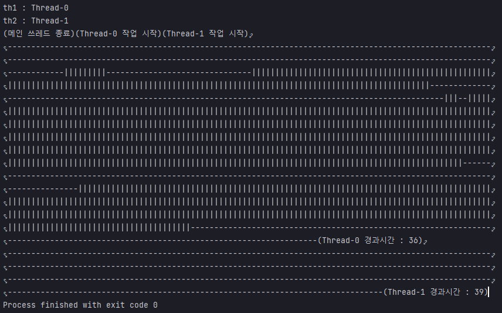

## 예제 13-4. 멀티스레드의 시간지연

자바의 정석 3판 기준 예제 13-5(p.733)의 예제를 실습한 결과.

## MyRunnable

```
public class MyRunnable implements Runnable{

    private String testString;

    MyRunnable(String testString) {
        this.testString = testString;
    }

    @Override
    public void run() {

        String threadName = Thread.currentThread().getName();
        // 작업 시작
        System.out.printf("(%s 작업 시작)", threadName);

        // 작업
        method();

        // 작업 시작 시점으로부터의 경과 시간
        long finishTime = System.currentTimeMillis();
        long timeGap = finishTime - Main.startTime;

        // 경과시간 출력
        System.out.printf("(%s 경과시간 : %d)", threadName, timeGap);
        return;
    }

    private void method() {
        for (int i=0; i< 1000; i++) {
            System.out.printf("%s",new String(testString)); // 쓰레드의 지연시간 확인을 용이하게 하기 위해 성능이 떨어지는 방식으로 문자열을 출력함
        }
    }
}
```
- 스레드 명을 출력
- 1000회동안 문자열 출력
- Main의 startTime과 종료 시점의 시간차를 출력

---

## Main

```
public class Main {

    public static long startTime; // 작업 시작시점


    public static void main(String[] args) {
        // currentTime을 현재 시각으로 변경
        startTime = System.currentTimeMillis();

        // 스레드 생성
        Thread th1 = new Thread(new MyRunnable("|"));
        Thread th2 = new Thread(new MyRunnable("-"));

        // 각 스레드의 이름
        System.out.println("th1 : "+th1.getName());
        System.out.println("th2 : "+th2.getName());

        // 각 쓰레드에서  실행
        th1.start();
        th2.start();

        System.out.print("(메인 쓰레드 종료)"); // 메인 쓰레드 종료
    }

}

```
- startTime을 기록
- 스레드 생성
- 스레드명 출력
- 각각의 스레드 작업 시작 (메인스레드, 스레드0, 스레드1)
- 모든 스레드 종료시 프로그램 종료

---

## 결과


- 실행환경
  - AMD Ryzen 5 5600X 6-Core Processor 3.70 GHz
  - RAM 32.0GB

- 멀티코어 환경이다보니, 싱글스레드 작업 때와 작업속도가 큰 차이가 없었음
- 싱글코어 환경에서는 평균적으로 싱글스레드 작업 때보다 시간이 길어진다고 함. (컨텍스트 스위칭 등)

---