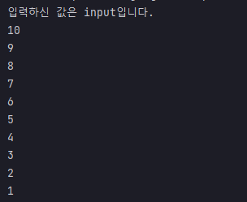

## 예제 13-5. 싱글스레드 - IO 블락킹

자바의 정석 3판 기준 예제 13-6(p.736)의 예제를 실습한 결과.

---

## Main

```
import javax.swing.*;

public class Main {

    public static void main(String[] args) {
        // 작업 1 : 입력
        String input = JOptionPane.showInputDialog("아무 값이나 입력하세용");
        System.out.printf("입력하신 값은 %s입니다.%n", input);

        // 작업 2 : 출력 (입력 대기 시간만큼을 대기하고 있고, 입력이 끝나야 실행됨.)
        for (int i=10; i>0; i--) {
            System.out.println(i);
            try {
                Thread.sleep(1000);
            } catch (InterruptedException e) {
                e.printStackTrace();
            }
        }
    }
}
```
- 별도의 GUI창을 띄워서 사용자에게 입력을 받는다.
- 입력이 종료되면 카운트 다운이 시작된다.
---

## 결과




- 입력이 완료되어야 출력이 시작됨.
- 입력이 완료될 때까지 다른 작업이 진행되지 않고 대기하고 있는 상황을 IO블락킹이라고 함.
- 각각의 상황은 같은 자원을 두고 경쟁하지 않으므로 싱글 스레드에서 함께 작업하는 것은 비효율적이다.

---