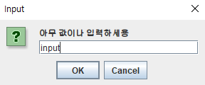
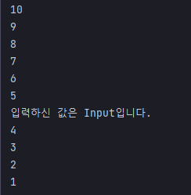

## 예제 13-6. 멀티스레드 - 병행(concurrent)

자바의 정석 3판 기준 예제 13-7(p.737)

---

## Main

```
    public static void main(String[] args) {
        // 작업 A : 출력
        Thread th = new Thread(new MyRunnable());
        th.start();

        // 작업 B : 입력
        String input = JOptionPane.showInputDialog("아무 값이나 입력하세용");
        System.out.printf("입력하신 값은 %s입니다.%n", input);

    }
```
- Thread를 생성하고, start를 호출
- 그리고 입력 작업이 수행된다.

---

## MyRunnable
```
public class MyRunnable implements Runnable {

    @Override
    public void run() {
        for (int i = 10; i > 0; i--) {
            System.out.println(i);
            try {
                Thread.sleep(1000);
            } catch (InterruptedException e) {
                e.printStackTrace();
            }
        }
    }
}

```
- 카운트 다운을 수행하는 스레드

---

## 결과





- 입력, 출력작업이 동시에 진행됨.
- 병행 : 여러 작업을 여러 스레드가 동시에 진행함
- 싱글스레드로 작업할 때는 입력을 받을 때까지 출력부가 작동하지 않았지만, 병행처리를 하여, 작업을 수행했더니 작업효율이 증가했다.

---