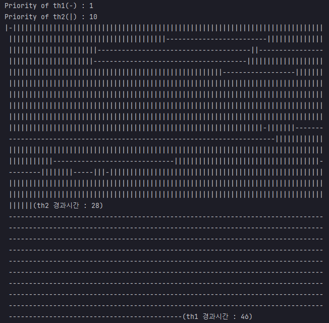
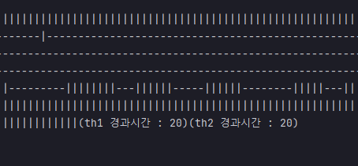

# 예제 13-7. 스레드의 우선순위

자바의 정석 3판 기준 예제 13-8(p.738)

---

## Main

```
    static long startTime;

    public static void main(String[] args) {
        startTime = System.currentTimeMillis();
        Thread th1 = new Thread(new MyRunnable("th1","-"));
        Thread th2 = new Thread(new MyRunnable("th2","|"));

        th1.setPriority(1);
        th2.setPriority(10);

        System.out.println("Priority of th1(-) : "+th1.getPriority());
        System.out.println("Priority of th2(|) : "+th2.getPriority());
        th1.start();
        th2.start();

    }
```
- th1의 우선순위는 1(낮음), th2의 우선순위는 10(높음)
- start메서드를 호출하여 각각의 스레드가 실행될 수 있게 하였다.

---

## MyRunnable
```
public class MyRunnable implements Runnable{

    private String name;
    private String str;

    MyRunnable(String name, String str) {
        this.name = name;
        this.str = str;
    }

    public void run() {
        method();
        finishTimePrint();
    }

    private void method() {
        for(int i=0; i<1000; i++) {
            System.out.print(str);
            for(int x=0; x<10000000; x++); // 아무 것도 하지 않는 반목문으로 시간 지연
        }
        return;
    }

    private void finishTimePrint() {
        long finishTime = System.currentTimeMillis();
        long timeGap = finishTime - Main.startTime;
        System.out.printf("(%s 경과시간 : %d)", name, timeGap);
    }


}
```
- 메시지 출력
- 종료시점의 시간 출력

---

# 결과

- 실행환경
    - AMD Ryzen 5 5600X 6-Core Processor 3.70 GHz
    - RAM 32.0GB






- 스레드의 우선순위를 1, 10으로 지정했음에도 거의 동시에 작업이 끝낸 경우 혹은 우선순위 지정과 무관하게 우선순위가 낮은 것이 먼저 완료된 경우도 존재
- 멀티코어 환경이라는 점, OS 스케쥴링 정책 및 OS별 JVM의 구현차이 등등의 변수가 있다보니 스레드별 우선순위 지정요청은 우선순위 보장을 확실히 하지 않음을 알 수 있다.
- 결국 우선순위 지정은 OS로부터의 작업할당 확률을 증가시키는게 원칙이긴 하나, 멀티코어 환경 등에서는 이것이 보장되지 않는다.
- OS님만이 알고 있어요...


# 반복 시행

```
01회 - th1 25 / th2 38
02회 - th1 26 / th2 25
03회 - th1 22 / th2 36
04회 - th1 47 / th2 28
05회 - th1 24 / th2 24
06회 - th1 40 / th2 22
07회 - th1 23 / th2 23
08회 - th1 44 / th2 30
09회 - th1 36 / th2 21
10회 - th1 22 / th2 22
11회 - th1 22 / th2 37
```
