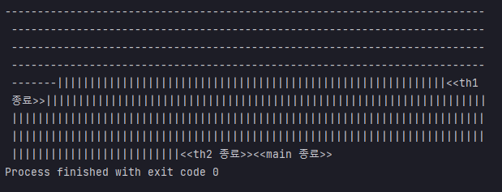

## 예제 13-11. sleep

자바의 정석 3판 기준 예제 13-12(p.750)의 예제를 실습한 결과.

---

## Main

```
public class Main {

    public static void main(String[] args) {
        Thread th1 = new Thread(new MyRunnable("-"), "th1");
        Thread th2 = new Thread(new MyRunnable("|"), "th2");

        th1.start();
        th2.start();
        try {
            th1.sleep(2000);
        } catch (InterruptedException e) {} // interrupt 명령이 발생하면, InterruptException이 throw되고 탈출한다.
        System.out.printf("<<%s 종료>>", Thread.currentThread().getName());
    }
    
}
```
- MyRunnable로 스레드를 생성하고 start를 통해 실행대기상태로 만든다.
- th1.sleep(2000)을 호출한다.
- 작업이 종료되면 현재 스레드가 종료됐음을 알리도록 한다.

---

## MyRunnable

```
public class MyRunnable implements Runnable{

    private String str;

    MyRunnable(String str) {
        this.str =str;
    }

    @Override
    public void run() {
        for(int i=0; i<300; i++) {
            System.out.print(str);
        }
        System.out.printf("<<%s 종료>>", Thread.currentThread().getName());
    }

}
```
- 생성 시 인자로 넣은 문자열을 300회 반복해서 출력하는 Runnable 구현체
- 작업 맨 마지막에, 종료 메시지를 출력한다.

---



- th1.sleep을 호출했으나, 정작 일시정지를 한 것은 호출한 쪽인 main 스레드쪽이였다.
- sleep은 static 메서드이고, 호출한 스레드 **자신의** 작업을 일시정지 시킨다.
  - Thread.sleep(...)으로 쓰도록 하자.

---