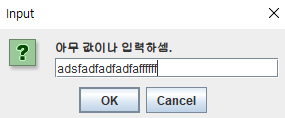
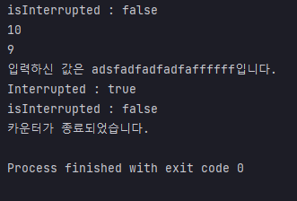

## 예제 13-12. interrupt - isInterrupted 상태 변경

자바의 정석 3판 기준 예제 13-13(p.752)의 예제를 실습한 결과.

---

## Main

```
    public static void main(String[] args) {
        Thread thread = new Thread(new MyRunnable());
        thread.start();

        String input = JOptionPane.showInputDialog("아무 값이나 입력하셈.");
        System.out.printf("입력하신 값은 %s입니다.%n", input);
        thread.interrupt();
    }
```
- MyRunnable로 스레드를 생성하고 start를 통해 실행대기상태로 만든다.
- 동시에 main 스레드에서는 사용자 입력을 받으면 입력값을 출력하고, 별도로 정의한 스레드의 `interrupt()`메서드를 호출한다.

---

## MyRunnable

```
public class MyRunnable implements Runnable{

    @Override
    public void run() {
        System.out.printf("isInterrupted : %b%n", Thread.currentThread().isInterrupted()); // 최초 isInterrupted 상태 출력

        int i= 10;
        while (i!=0 && !Thread.currentThread().isInterrupted()) {
            System.out.println(i--);
            for (long x=0; x<25_0000_0000L; x++); // 시간 지연
        }
        System.out.printf("Interrupted : %b%n", Thread.interrupted()); // Thread.interrupted() 메서드는 호출한 스레드의 isInterrupted 상태를 반환 후, isInterrupted 상태를 false로 돌린다.
        System.out.printf("isInterrupted : %b%n", Thread.currentThread().isInterrupted()); // isInterrupted() 메서드는 스레드의 isInterrupted의 상태를 반환한다.
        System.out.println("카운터가 종료되었습니다.");
    }
}
```
- 최초 1회, isInterrupted() 인스턴스를 호출하여 상태를 출력
- 카운트를 10 지정
- count가 0이 되거나 스레드가 isInterrupted 상태가 될때까지, 반복한다.
  - 카운트를 감소하며 출력
  - 시간지연
- 반복종료되면 Thread.interrupted() 메서드를 호출하여 출력
- 다시 한번 현재 스레드.interrupted() 메서드를 호출하여 출력
- 카운터 종료

---

# 결과





- 입력 후 interrupt
- interrupt 후, 다음 반복 때 반복 탈출
- `Thread.isInterrupted()`을 호출한 결과 isInterrupted 상태가 true가 됨.
- 하지만 다시 `Thread.currentThread().isInterrupted()`을 호출하면, isInterrupted 상태가 false가 되어있음을 확인할 수 있다.

---