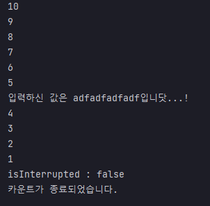

## 예제 13-13. interrupt - WAITING, TIMED_WAITING 상태 탈출 - 1

자바의 정석 3판 기준 예제 13-14(p.753)의 예제를 실습한 결과.

---

## Main

```
import javax.swing.*;

public class Main {

    public static void main(String[] args) {
        Thread thread = new Thread(new MyRunnable());
        thread.start();

        String input = JOptionPane.showInputDialog("아무 값이나 입력하셈...!!!");
        System.out.printf("입력하신 값은 %s입니닷...!%n", input);
        thread.interrupt();
    }
}
```
- MyRunnable로 스레드를 생성하고 start를 통해 실행대기상태로 만든다.
- 동시에 main 스레드에서는 사용자 입력을 받으면 입력값을 출력하고, 별도로 정의한 스레드의 `interrupt()`메서드를 호출한다.

---

## MyRunnable

```
public class MyRunnable implements Runnable {

    @Override
    public void run() {
        int i = 10;
        while (i > 0 && !Thread.currentThread().isInterrupted()) {
            System.out.println(i--); // 타이머 감소
            try {
                Thread.sleep(1000); // 1초 지연
            } catch (InterruptedException e) {}
        }
        System.out.printf("isInterrupted : %b%n", Thread.currentThread().isInterrupted());
        System.out.println("카운트가 종료되었습니다.");
    }
}
```
- 카운트를 10 지정
- count가 0보다 크고, interrupted상태가 false일 동안 1초마다 카운트를 감소시키면서 출력
  - InterruptException이 발생하면, 아무것도 수행하지 않음.

---

# 결과


- 입력 후 interrupt
- interrupt 후, 다음 반복때 탈출하지 않음. catch되고 `isInterrupted` 상태가 다시 false로 변했기 때문
- 따라서 입력을 받더라도 카운트가 계속 다운되고, 마지막에 `isInterrupted()`을 호출했음에도 false가 반환됨.

---