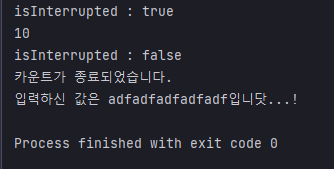

## 예제 13-14. interrupt - WAITING, TIMED_WAITING 상태 탈출 - 2

자바의 정석 3판 기준 예제 13-14(p.753)의 예제를 변형함

---

## Main

```
import javax.swing.*;

public class Main {

    public static void main(String[] args) {
        Thread thread = new Thread(new MyRunnable());
        thread.start();

        String input = JOptionPane.showInputDialog("아무 값이나 입력하셈...!!!");
        System.out.printf("입력하신 값은 %s입니닷...!%n", input);
        thread.interrupt();
    }
}
```
- MyRunnable로 스레드를 생성하고 start를 통해 실행대기상태로 만든다.
- 동시에 main 스레드에서는 사용자 입력을 받으면 입력값을 출력하고, 별도로 정의한 스레드의 `interrupt()`메서드를 호출한다.

---

## MyRunnable

```
public class MyRunnable implements Runnable {

    @Override
    public void run() {
        int i = 10;
        Thread.currentThread().interrupt(); // isInterrupted 상태를 true로 변경한다.
        System.out.printf("isInterrupted : %b%n", Thread.currentThread().isInterrupted());
        while (i > 0) {
            System.out.println(i--); // 타이머 감소
            try {
                Thread.sleep(1000); // 1초 지연
            } catch (InterruptedException e) {
                break;
            }
        }
        System.out.printf("isInterrupted : %b%n", Thread.currentThread().isInterrupted());
        System.out.println("카운트가 종료되었습니다.");
    }
}
```
- 카운트를 10 지정
- 스레드 스스로를 interrupt 시킨다. -> isInterrupted 상태가 true가 됨.
- count가 0보다 큰 상황에서 반복한다.
  - `InterruptedException`이 발생하면, 반복문을 탈출

---

# 결과

- 입력하기도 전에 반복을 10초 카운트를 출력하고 반복문을 탈출함.
- isInterrupted 상태가 다시 false가 됨
  - InterrupedException이 catch되고 다시 false로 변했음을 알 수 있음
- sleep 메서드 호출 전부터 이미 `isInterrupted` 상태가 true이면 `InterruptedException`이 throw 됨을 알 수 있다.
   
---