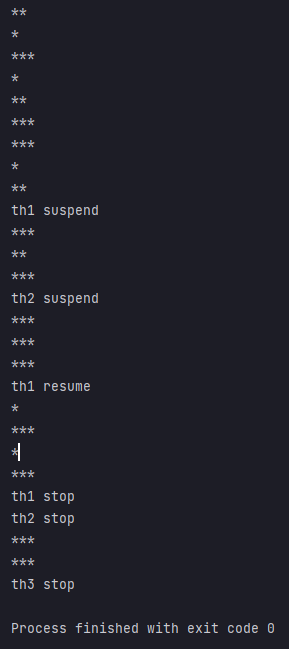

## 예제 13-15. suspend(), resume(), stop() - 1

자바의 정석 3판 기준 예제 13-15(p.755) 내용 분석, 정리

---

# Main

```

public class Main {

    public static void main(String[] args) {
        Runnable runnable = new MyRunnable();
        Thread th1 = new Thread(runnable, "*");
        Thread th2 = new Thread(runnable, "**");
        Thread th3 = new Thread(runnable, "***");

        th1.start();
        th2.start();
        th3.start();

        try {
            Thread.sleep(2000);
            th1.suspend();
            System.out.println("th1 suspend");
            Thread.sleep(2000);
            th2.suspend();
            System.out.println("th2 suspend");
            Thread.sleep(3000);

            th1.resume();
            System.out.println("th1 resume");
            Thread.sleep(3000);

            th1.stop();
            System.out.println("th1 stop");
            th2.stop();
            System.out.println("th2 stop");
            Thread.sleep(2000);
            th3.stop();
            System.out.println("th3 stop");
        } catch (InterruptedException e) {}
    }
}
```
- th1, th2, th3을 생성하고 suspend, resume, stop 명령을 시간차를 두고 줌

---

# MyRunnable

```
public class MyRunnable implements Runnable{

    @Override
    public void run() {
        while(true) {
            System.out.println(Thread.currentThread().getName());
            try {
                Thread.sleep(1000);
            } catch (InterruptedException e) {}
        }
    }
}
```
- 현재 스레드의 이름을 1초마다 무한 반복하여 출력함

---

# 결과



- th1,th2,th3이 번갈아가면서 수행
- th1이 suspend되고 th2,th3만 작동
- th2가 suspend되고 th3만 작동
- th1을 resume하고 th1,th3만 작동
- th1,th2를 stop하고 th3만 작동
- th3을 stop 시키고 모든 스레드 종료되어 프로그램이 종료됨

---