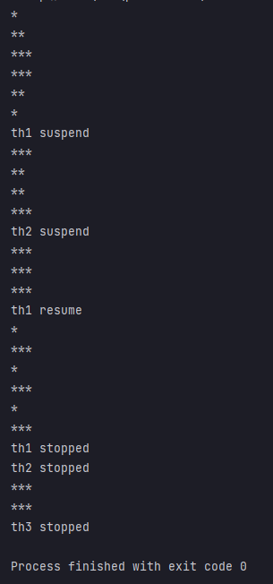

## 예제 13-16. suspend(), resume(), stop() - 2

자바의 정석 3판 기준 예제 13-16(p.756) 내용 분석, 정리  
(예제 13-15에서 MyRunnable에서 자체적으로 suspend, resume, start를 정의함)

---

# Main

```
public class Main {

    public static void main(String[] args) {
        MyRunnable r1 = new MyRunnable();
        MyRunnable r2 = new MyRunnable();
        MyRunnable r3 = new MyRunnable();

        Thread th1 = new Thread(r1, "*");
        Thread th2 = new Thread(r2, "**");
        Thread th3 = new Thread(r3, "***");

        th1.start();
        th2.start();
        th3.start();

        try {
            Thread.sleep(2000);
            r1.suspend();
            System.out.println("th1 suspend");
            Thread.sleep(2000);
            r2.suspend();
            System.out.println("th2 suspend");
            Thread.sleep(3000);

            r1.resume();
            System.out.println("th1 resume");
            Thread.sleep(3000);

            r1.stop();
            System.out.println("th1 stopped");
            r2.stop();
            System.out.println("th2 stopped");
            Thread.sleep(2000);
            r3.stop();
            System.out.println("th3 stopped");
        } catch (InterruptedException e) {}

    }
}
```
- MyRunnable r1,r2,r3를 생성
- 이를 기반으로 Thread th1, th2, th3을 생성
- r1,r2,r3에 대해 suspend, resume, stop 명령을 시간차를 두고 줌

---

# MyRunnable

```

public class MyRunnable implements Runnable {

    private volatile boolean suspended = false;
    private volatile boolean stopped = false;

    @Override
    public void run() {
        while(!stopped) {
            if (!suspended) {
                System.out.println(Thread.currentThread().getName());
                try {
                    Thread.sleep(1000);
                } catch (InterruptedException e) {}
            }
        }
    }

    public void suspend() {
        suspended = true;
    }

    public void resume() {
        suspended = false;
    }

    public void stop() {
        stopped = true;
    }
}
```
- suspended, stopped 상태가 아닐 때 현재 스레드의 이름을 1초마다 무한 반복하여 출력함
- suspended 상태에서 resume으로 변하면 다시 작업을 재개하도록 함.
- stopped 상태가 되면 반복을 탈출하고 스레드가 종료됨

---

# 결과



- th1,th2,th3이 번갈아가면서 수행
- r1이 suspend되고 th2,th3만 작동
- r22가 suspend되고 th3만 작동
- r1을 resume하고 th1,th3만 작동
- r1,r2를 stop하고 th3만 작동
- r3을 stop 시키고 모든 스레드 종료되어 프로그램이 종료됨

---