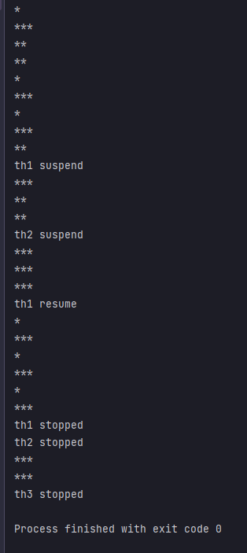

## 예제 13-17. suspend(), resume(), stop() - 3

자바의 정석 3판 기준 예제 13-17(p.758) 내용 분석, 정리  
(예제 13-16을 추가 변형하여, MyThread를 재설계)

---

## Main

```
public class Main {

    public static void main(String[] args) {

        MyThread th1 = new MyThread("*");
        MyThread th2 = new MyThread("**");
        MyThread th3 = new MyThread("***");

        th1.start();
        th2.start();
        th3.start();

        try {
            Thread.sleep(2000);
            th1.suspend();
            System.out.println("th1 suspend");
            Thread.sleep(2000);
            th2.suspend();
            System.out.println("th2 suspend");
            Thread.sleep(3000);

            th1.resume();
            System.out.println("th1 resume");
            Thread.sleep(3000);

            th1.stop();
            System.out.println("th1 stopped");
            th2.stop();
            System.out.println("th2 stopped");
            Thread.sleep(2000);
            th3.stop();
            System.out.println("th3 stopped");
        } catch (InterruptedException e) {}

    }
}

```
- MyThread th1,th2,th3을 생성
- th1,th2,th3에 대해 각각에서 정의한 suspend, resume, stop 메서드를 시간차를 실행함.

---

## MyThread

```
public class MyThread implements Runnable {

    private Thread thread;

    public MyThread(String name) {
        thread = new Thread(this, name);
    }

    public void start() {
        thread.start();
    }

    private volatile boolean suspended = false;
    private volatile boolean stopped = false;

    @Override
    public void run() {
        while(!stopped) {
            if (!suspended) {
                System.out.println(Thread.currentThread().getName());
                try {
                    Thread.sleep(1000);
                } catch (InterruptedException e) {}
            }
        }
    }

    public void suspend() {
        suspended = true;
    }

    public void resume() {
        suspended = false;
    }

    public void stop() {
        stopped = true;
    }
}

```
- Runnable을 상속함.
- 내부적으로 Thread를 멤버변수로 가짐
- 생성 시, 지정한 이름으로 새로운 스레드를 생성하여 멤버에 저장
- start 호출시 내부 thread의 `start()`를 실행함.
- 스레드의 내부 로직은 run 메서드에서 구현함
  - suspended, stopped 상태가 아닐 때 현재 스레드의 이름을 1초마다 무한 반복하여 출력함
  - suspended 상태에서 resume으로 변하면 다시 작업을 재개하도록 함.
  - stopped 상태가 되면 반복을 탈출하고 스레드가 종료됨

---

## 결과



- th1,th2,th3이 번갈아가면서 수행
- th1이 suspend되고 th2,th3만 작동
- th2가 suspend되고 th3만 작동
- th1을 resume하고 th1,th3만 작동
- th1,th2를 stop하고 th3만 작동
- th3을 stop 시키고 모든 스레드 종료되어 프로그램이 종료됨

---