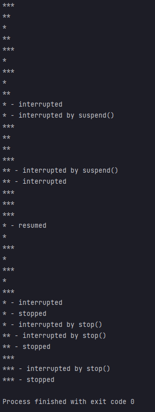

## 예제 13-18. yield

자바의 정석 3판 기준 예제 13-17(p.758) 내용 분석, 정리  
(예제 13-16을 추가 변형하여, MyThread를 재설계)

---

## Main

```

public class Main {

    public static void main(String[] args) {
        MyThread mth1 = new MyThread("*");
        MyThread mth2 = new MyThread("**");
        MyThread mth3 = new MyThread("***");

        mth1.start();
        mth2.start();
        mth3.start();

        try {
            Thread.sleep(2000);
            mth1.suspend();
            Thread.sleep(2000);
            mth2.suspend();
            Thread.sleep(3000);
            mth1.resume();
            Thread.sleep(3000);
            mth1.stop();
            mth2.stop();
            Thread.sleep(2000);
            mth3.stop();
        } catch (InterruptedException e) {}
    }
}
```
- MyThread 3개 생성, 실행
- 각 스레드에 대해 suspend, resume, sleep 등을 연속적으로 사용

---

## MyThread

```
public class MyThread implements Runnable {

    private Thread thread;

    private volatile boolean stopped;
    private volatile boolean suspended;


    public MyThread(String name) {
        this.thread = new Thread(this, name);
    }

    public void start() {
        this.thread.start();
    }

    @Override
    public void run() {
        String name = thread.getName();
        while (!stopped) {
            if (!suspended) {
                System.out.println(name);
                try {
                    Thread.sleep(1000);
                } catch (InterruptedException e) {
                    System.out.printf("%s - interrupted%n", name);
                }
            } else {
                Thread.yield(); // 현재 스레드의 주어진 실행시간을 포기하고, 다음 스레드에게 양보한다. -> 반응성 향상
            }
        }
        System.out.printf("%s - stopped%n", name);
    }

    public void suspend() {
        this.suspended = true;
        thread.interrupt(); // sleep중인 상황에서 suspend 발생시 바로 InterruptException을 발생시켜서, sleep 상태에서 탈출하도록 하기 위함
        System.out.printf("%s - interrupted by suspend()%n", thread.getName());
    }

    public void resume() {
        this.suspended = false;
        System.out.printf("%s - resumed%n", thread.getName());
    }

    public void stop() {
        this.stopped = true;
        thread.interrupt(); // sleep중인 상황에서 stop 발생시 바로 InterruptException을 발생시켜서, sleep 상태에서 탈출하도록 하기 위함
        System.out.printf("%s - interrupted by stop()%n", thread.getName());
    }
}
```
- 객체 생성시 내부적으로 멤버인 thread에 객체 자신(Runnable 구현)을 인자로 하여 새로운 Thread를 생성하여 저장
- start 호출 시 thread를 start 시킨다.
- run()
  - suspended, stopped 상태가 아닐 시 스레드 이름을 출력후, 1초
  - suspended 상태일 경우 `Thread.yield()`를 호출하여 스레드 자신에게 할당된 작업시간을 포기하고, 다음 스레드에게 순서를 양보한다.
- suspend(), stop()
  - 메서드가 호출될 때 thread를 interrupt한다.
  - 만약 스레드가 sleep 상태일 경우 바로 InterruptedException이 발생하여, sleep 상태를 바로 탈출하여, suspend, stop 명령에 대한 반응성을 높일 수 있다.

---

## 결과



- suspended 상태가 아닐 떄 yield 메서드를 바로 호출함으로서, 무의미한 반복을 막고 다음 스레드로 순서를 양보함으로서 효율이 증가
- suspend, stop 명령 수행시 thread 스스로를 interrupt 시킴으로서 sleep 상태일 때 바로 InterruptException을 발생시킴 -> 불필요한 시간지연제거

---