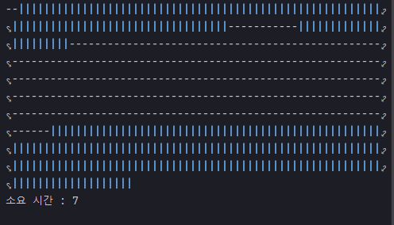

---

## 예제 13-19. join - 1

자바의 정석 p.763의 예제 13-19를 직접 타이핑하고, 실행하여 코드 내용을 분석

---

## Main

```
public class Main {

    public static void main(String[] args) {

        Thread th1 = new Thread(new MyRunnable("-"));
        Thread th2 = new Thread(new MyRunnable("|"));

        th1.start();
        th2.start();
        long startTime = System.currentTimeMillis();

        try {
            th1.join(); // th1, th2가 종료될 때까지 기다린다.
            th2.join();
        } catch (InterruptedException e) {}

        long finishTime = System.currentTimeMillis();
        System.out.printf("%n소요 시간 : %d%n", finishTime - startTime);
    }
}
```
- th1, th2 생성 및 start
  - start 직후 시간을 측정
- th1, th2의 작업이 종료되기를 기다림 (join)
- 작업이 종료되면 종료시점 시간을 출력한다.

## MyRunnable

```
public class MyRunnable implements Runnable{

    private String str;

    public MyRunnable(String str) {
        this.str = str;
    }

    @Override
    public void run() {
        for (int i=0; i<300; i++) {
            System.out.print(new String(str));
        }
    }
}

```
- 반복해서 300회, 동일 문자를 출력하는 메서드

---

## 결과


- 두 스레드의 작업이 모두 수행될 때까지 메인스레드가 기다림.
- `join()` 메서드를 호출하지 않았을 경우, 메인스레드는 바로 작업을 종료했을 것.

---
