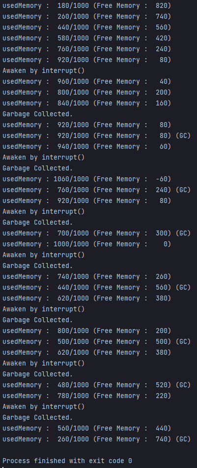
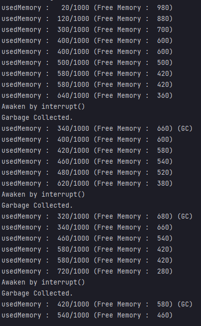

---

## 예제 13-20. join - 2

자바의 정석 p.764에 수록된 예제 13-20을 실제 작성해보고 코드의 작동 원리를 분석해본다.

---

## GarbageCollector

```
public class GarbageCollector implements Runnable {

    private final static int MAX_MEMORY = 1000;
    private int usedMemory = 0;

    private Thread thread;

    public GarbageCollector() {
        this.thread = new Thread(this);
    }
...
```
- Runnable 인터페이스를 상속
- 생성자 호출시 스스로를 인자로 하여 thread를 생성한다.

```
    // 현재 사용된 메모리를 반환한다.
    public int usedMemory() {
        return usedMemory;
    }

    // 최대 메모리를 반환한다.
    public int totalMemory() {
        return MAX_MEMORY;
    }

    // 여유 메모리를 반환한다.
    public int freeMemory() {
        return MAX_MEMORY - usedMemory;
    }

    // thread를 daemon 스레드로 만든다.
    public void setDaemon() {
        this.thread.setDaemon(true);
    }

    // thread를 실행한다.
    public void start() {
        this.thread.start();
    }

    // 지정 메모리만큼 사용한다.
    public void useMemory(int usingMemory) {
        this.usedMemory += usingMemory;
    }
```
- 메모리 관련 정보를 호출하는 메서드 : usedMemory, totalMemory, freeMemory, ...
- setDaemon() : 스레드를 데몬 스레드로 함.
- start : 스레드 실행
- useMemory : 메모리 사용량 증가

```
    @Override
    public void run() {
        while (true) {
            try {
                Thread.sleep(10_000); // 10초 대기
            } catch (InterruptedException e) { // 도중에 interrupt가 발생하면 깨어난다.
                System.out.println("Awaken by interrupt()");
            }
            garbageCollect(); // garbageCollect를 작동한다.
            System.out.println("Garbage Collected.");
            System.out.printf("usedMemory : %4d/%4d (Free Memory : %4d) (GC)%n", usedMemory, totalMemory(), freeMemory());
        }
    }
    
    public void interrupt() {
        this.thread.interrupt();
    }

    public void join(int millis) {
        try {
            thread.join(millis);
        } catch (InterruptedException e) {}
    }

    // 가비지 컬렉터 작동 - 불필요한 메모리를 300 정리한다.
    private void garbageCollect() {
        this.usedMemory -= 300;
        if (this.usedMemory < 0) usedMemory = 0;
    }
```
- 실제 스레드의 내부 로직 : run()
  - 평상시 최대 10초 대기, 기본적으로 10초마다 가비지컬렉터를 작동 후 사용된 메모리양 출력
  - InterruptException이 발생하면 sleep을 탈출하여, 가비지컬렉터 작동 후 사용된 메모리양 출력
- interrupt : thread에 interrupt
- join : thread를 millis 기다림
- garbagecollect() : 메모리를 300 감소시킴.

---

## Main1

```
public class Main1 {

    public static void main(String[] args) {
        GarbageCollector gc = new GarbageCollector();
        gc.setDaemon(); // gc를 데몬스레드로 만든다.
        gc.start(); // gc start

        int requiredMemory = 0; // 필요 메모리

        for (int i=0; i<20; i++) {
            requiredMemory = (int) (Math.random() * 10) * 20; // 현재 작업에서 필요한 메모리양(여기선 랜덤으로 지정했음.)

            // 남은 메모리의 양이 필요 메모리의 양보다 작거나, 남은 메모리의 양이 전체 메모리양의 40% 미만일 경우 gc를 작동한다.
            if (gc.freeMemory() < requiredMemory || gc.freeMemory() < gc.totalMemory() * 0.4) {
                gc.interrupt();
            }
            gc.useMemory(requiredMemory); // requiredMemory 만큼, usedMemory를 증가시킨다.
            System.out.printf("usedMemory : %4d/%4d (Free Memory : %4d)%n", gc.usedMemory(), gc.totalMemory(), gc.freeMemory());
        }
    }

}
```
- GarbageCollector를 생성 후 이를 데몬스레드로 지정한 뒤 실행
- 총 20회 동안, 메모리 사용량을 증가시키는 작업을 반복한다.
  - 실험을 위해 requiredMemory를 임의의 값을 생성하여 받아옴.
  - 남은 메모리의 양이 필요 메모리의 양보다 작거나, 남은 메모리 양이 전체 메모리양의 40% 미만일 경우, gc에 interrupt 한다.
  - requiredMemory만큼 메모리를 사용(메모리 증가)
  - 사용된 메모리양 및 여유 메모리량을 출력

---

## Main1 실행 결과


- usedMemory가 1000을 넘어가는 모순이 발생함
- 본래 기대했던 상황은?
  - 남은 메모리보다, 사용할 메모리양이 많은 상황이다보니 가비지 컬렉터로 메모리를 정리하고, 메모리가 증가해야 했음.
  - interrupt되어, sleep문을 탈출
  - garbageCollector가 작동하고 메모리가 정리된 뒤의 결과값이 출력
  - requiredMemory를 증가시킴.
- 하지만 실제 일어난 일은 어떤가?
  - interrupt 되어 sleep문을 탈출하고 garbageCollect되기 전에, if문 이후 이어지는 `gc.addUsedMemory(requiredMemory)`이 작동함
- 가비지 컬렉터가 작동하고 다음 작업으로 넘어갈 수 있을 정도의 적절한 시간이 주어져야함. interrupt 이후 join을 사용하면 잠시 기다려서 적절한 시간을 벌고, 이 문제를 해결할 수 있다.

---

## Main2
```
    // 남은 메모리의 양이 필요 메모리의 양보다 작거나, 남은 메모리의 양이 전체 메모리양의 40% 미만일 경우 gc를 작동한다.
    if (gc.freeMemory() < requiredMemory || gc.freeMemory() < gc.totalMemory() * 0.4) {
        gc.interrupt();
        gc.join(100); // 100ms 대기
    }
    gc.useMemory(requiredMemory); // requiredMemory 만큼, usedMemory를 증가시킨다.
```
- interrupt 직후 100ms 대기한 뒤(가비지 컬렉터가 작동할 시간을 충분히 준 뒤), 다음 작업으로 넘어가도록 함

---

## Main2 실행 결과


- join을 삽입해서, 가비지 컬렉터가 작동할 시간이 충분히 주어진 덕에
  - 가비지 컬렉터가 작동 후 메모리가 증가함.
  - 메모리가 증가하고 가비지컬렉터가 작동하는 모순이 사라짐

---
